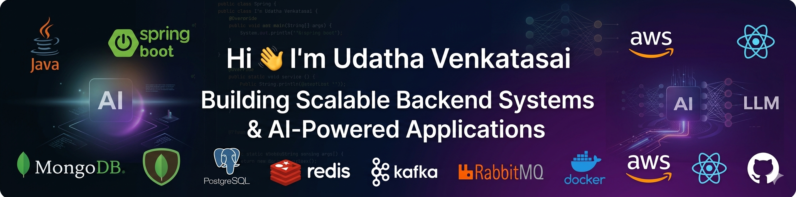

  

# Hi 👋 I'm Udatha Venkatasai

### Backend Engineer | Java • Spring Boot • Microservices • AI/LLM Applications

🚀 Building scalable backend systems using Java, Spring Boot, MongoDB, Redis, RabbitMQ, Elasticsearch and AI-powered solutions.

🌱 Currently learning System Design, Kafka, Event-Driven Architecture and Open Source Development.

💡 Interested in AI Applications, RAG Systems, MCP Servers and Distributed Systems.

<h3>🛠️ Skills</h3>

## 💻 Most Used Languages

## 📊 GitHub Stats

## 🔥 GitHub Streak

## 📫 Connect With Me

  
  
  

